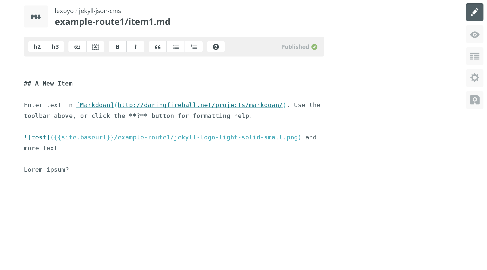

# jekyll-json-cms

A jekyll template made to serve content in JSON format. Administered your content with Github or prose.io and deploy your JSON API to Github pages.

Example of output routes: 

* [list of routes](http://lexoyo.me/jekyll-json-cms/index.json)
* [items of the folder `/example-route1/`](http://lexoyo.me/jekyll-json-cms/example-route1/index.json)

Here is how content edition looks in prose.io:



## Usecase

If you are running a static website and you need to manage items to be displayed in your website, with pictures and text and other meta data, then you need a tool to generate json files.

[Jekyll](https://jekyllrb.com/) is perfect to generate JSON static files out of a hierarchy of flat markdown files. Also Github pages will build deploy using Jekyll without the need to install Jekyll. And there are tools which make it easy to edit the markdown files, upload images to github, and publish without using git.

Other use cases

* multiple photo galeries with description
* articles to purchase, with a price and paypal link
* blog posts to be displayed on an existing website
* list of the people in your company with photo, bio and website

## Instructions

Clone this repository and open `http://[YOUR GTHUB NAME].github.io/jekyll-json-cms/index.json`. This will list the folders which contain an `index.json` file with the content, i.e. the categories of items:

```

[
  {
    "url": "/index.json",
    "path": "index.json",
    "dir": "/"
  },
  {
    "url": "/example-route1/index.json",
    "path": "example-route1/index.json",
    "dir": "/example-route1"
  },
  {
    "url": "/example-route2/index.json",
    "path": "example-route2/index.json",
    "dir": "/example-route2"
  }
]
```

Navigate to a "route" or "category" like `http://[YOUR GTHUB NAME].github.io/jekyll-json-cms/example-route2/index.json` and you will have a list of "items" or "pages" such as:

```
[
   {
      "price":"$99",
      "another-data":"test me lol",
      "published":true,
      "image":"/example-route2/jekyll-logo-light-solid-small.png",
      "content":"## A New Item\n\nEnter text in [Markdown](http://daringfireball.net/projects/markdown/). Use the toolbar above, or click the **?** button for formatting help.\n",
      "dir":"/example-route1",
      "name":"item1.md",
      "path":"example-route1/item1.md",
      "url":"/example-route1/item1.html"
   },
   {
      "price":"$12",
      "another-data":"another test data",
      "content":"## Here is a cool item\n\nDescription comes here with text formatting\n\n",
      "dir":"/example-route1",
      "name":"item2.md",
      "path":"example-route1/item2.md",
      "url":"/example-route1/item2.html"
   }
]
```

Now start changing the markdown file `/example-route1/item1.md`, by hand (online on github you can edit files) or with a tool like those listed bellow. When you change or add a file, it changes or add an item in the JSON file located in the same folder.

## Meta data

To add data fields to the list of items, such as a price or description, add it to the "Front matter" section, which can be accessed in prose.io with the "settings" icon on the right, and which is simply a section at the beginning of your files, [see this file for example](https://raw.githubusercontent.com/lexoyo/jekyll-json-cms/gh-pages/example-route1/item1.md), it has the metadata `price` , `another-data`, `image`... 

```
---
price: $99
"another-data": test me lol
published: true
image: "/example-route1/jekyll-logo-light-solid-small.png"
---
## A New Item

Enter text in [Markdown](http://daringfireball.net/projects/markdown/). Use the toolbar above, or click the **?** button for formatting help.

 and more text

Lorem ipsum?
```
Add a line and a `"key": "value"` pair and it will be found in the JSON output, e.g. in `example-route1/index.json` you will have an item with 

```
   {
      "price":"$99",
      "another-data":"test me lol",
      "published":true,
      "image":"/example-route2/jekyll-logo-light-solid-small.png",
      "content":"## A New Item\n\nEnter text in [Markdown](http://daringfireball.net/projects/markdown/). Use the toolbar above, or click the **?** button for formatting help.\n",
      "dir":"/example-route1",
      "name":"item1.md",
      "path":"example-route1/item1.md",
      "url":"/example-route1/item1.html"
   }
```

## Tools to manage content

They make it easy to manage your content without using git

* [Prose.io](http://prose.io/)
* [CloudCannon](http://cloudcannon.com/)
